| Raden Rizki | 2141720064 | TI - 3C | 13 |

## Praktikum 1: Event Handler

### Langkah 1

### Langkah 2

## Praktikum 2

### Langkah 1

Tampilan pada browser menampilkan button kedua dengan berupa pembatas berdasarkan tag hr dan nama button sesuai dengan arguments yang diberikan pada value namaTombol di component Tombol_2 tersebut. Selain itu, pesan yang ditampilkan juga didasarkan pada argument isiPesan Tombol_2.

## Praktikum 3

### Langkah 1: Propagation

### Langkah 2: Stop Propagation

## Praktikum 4

### Langkah 1

### Langkah 2

**Soal**
1. Jika kita menekan tombol "Artikel Selanjutnya" sebanyak 5x (atau melebihi halaman total artikel), apa yang akan terjadi?

Terjadi error karena indeks sudah melebihi indeks terakhir dari list data. Sehingga menampilkan pesan tersebut.

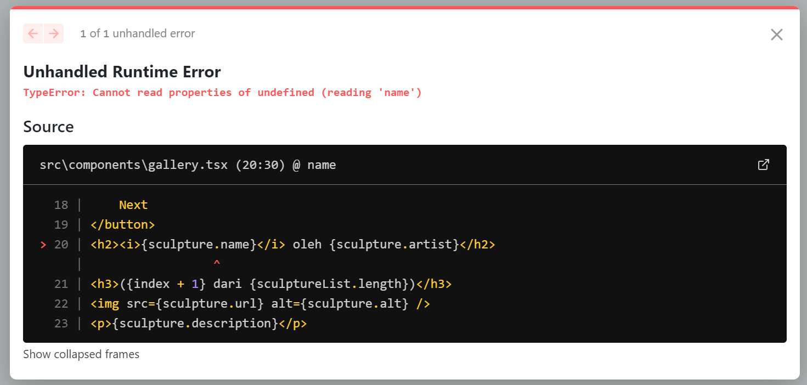

2. Modifikasilah gallery.tsx agar bisa meng-handle permasalahan tersebut.

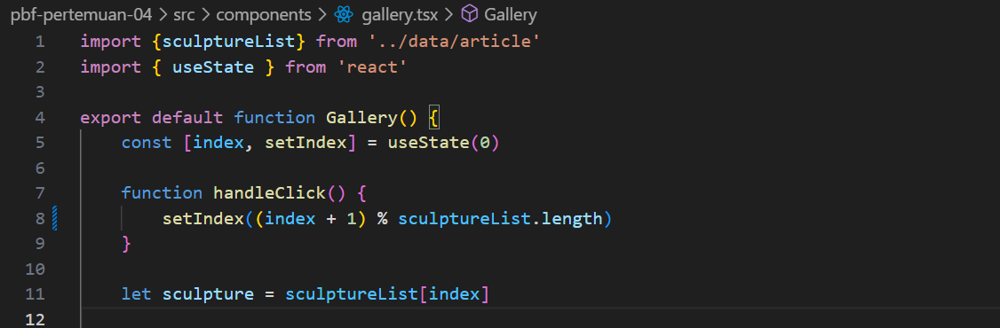

Dengan menambahkan modulus pada increment dari index, maka hasil yang akan dihasilkan adalah antara 0 sampai index terakhir.

3. Tambahkan tombol "Artikel Sebelumnya", untuk menampilkan artikel secara mundur.

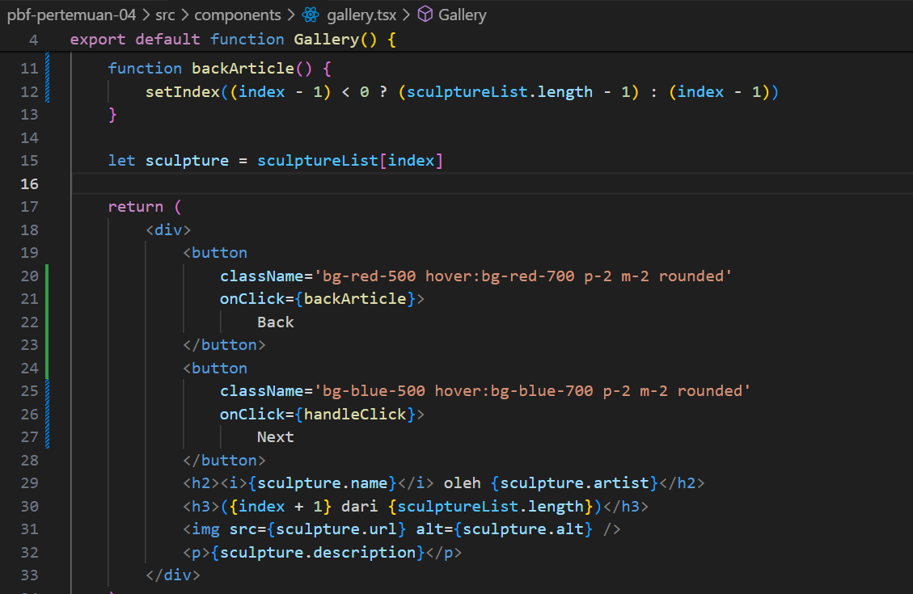

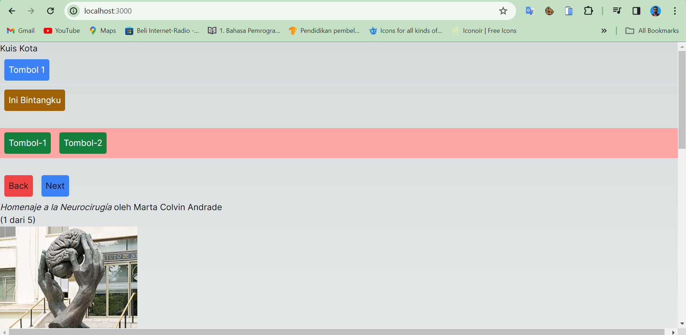

Ternary operator dapat membantu dalam membuat kondisi dalam satu baris seperti diatas, sehingga dengan menggunakan kondisi tersebut yaitu jika index baru kurang dari 0, maka value baru akan diset manjadi index terakhir dari list.

## Praktikum 5

### Langkah 1

Form Code: [Go to form.tsx](/pbf-pertemuan-04/src/components/form.tsx)

Page Code: [Go to page.tsx](/pbf-pertemuan-04/src/app/page.tsx)

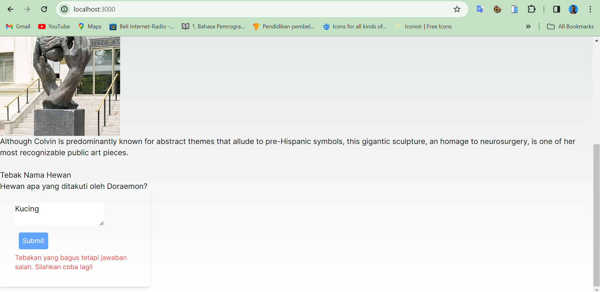

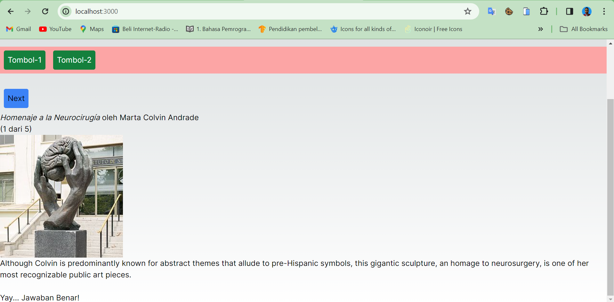

Dengan menggunakan kondisi dan state yang dapat diperbarui, setiap jawaban pada form dapat menampilkan pesan error yang berbeda-beda, jika jawaban salah maka pesan error akan ditampilkan karena ini memenuhi kondisi untuk menampilkan error dari tag p, sedangkan jika jawaban benar, maka form tidak akan ditampilkan dan menampilkan pesan "Yay... Jawaban Benar!" karena state status menjadi success dan pesan tersebut akan direturn.

### Langkah 2

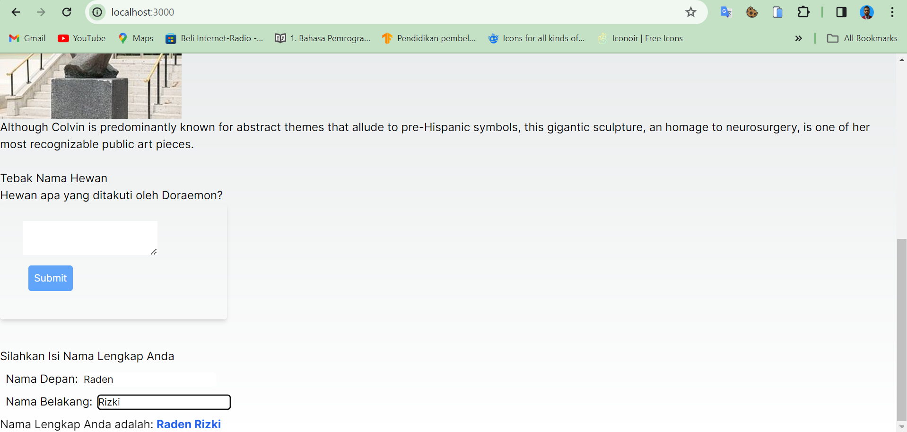

**Soal**

1. Apa perbedaan dari fungsi Form_2 yang pertama dengan yang kedua?

2. Kenapa perlu menghapus state fullName? Apa keuntungannya?

## Praktikum 6

### Langkah 1

Accordion Code: [Go to accordion.tsx](/pbf-pertemuan-04/src/components/accordion.tsx)

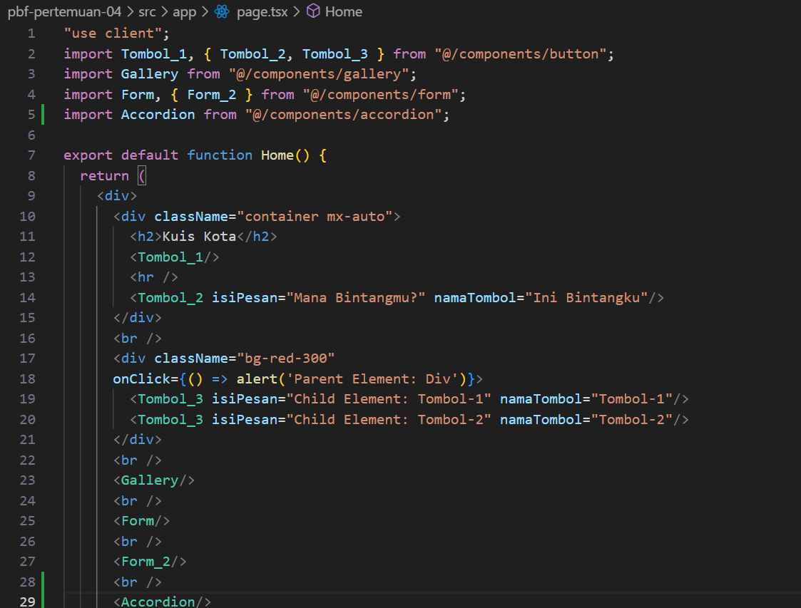

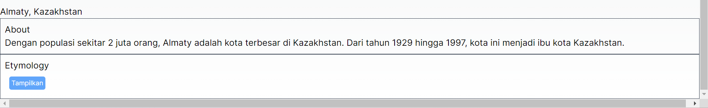

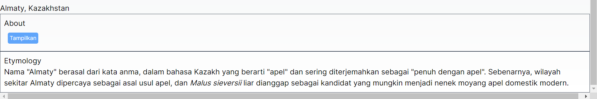

Setiap panel ditampilkan secara bergantian, tergantung panel mana yang diklik "Tampilkan". Hal tersebut dapat terjadi dengan mengecek kondisi antara activeIndex saat ini dengan value dari setiap panel, jika panel memiliki activeIndex dan value yang sesuai maka teks akan ditampilkan. Saat button "Tampilkan" diklik maka activeIndex saat ini juga akan ikut berubah.

### Langkah 2

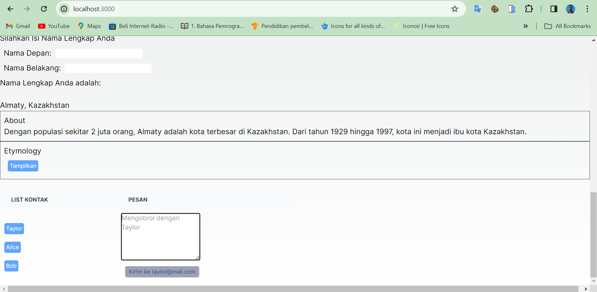

Perbedaan yang dihasilkan dari penggunaan <Chat contact={to}/> dengan <Chat key={to.email} contact={to}/> adalah tidak ada, baik dari tampilan maupun state yang dimiliki, dikarenakan dalam functio Chat tidak terdapat parameter key, sehingga argument tersebut tidak diolah sama sekali oleh function Chat.