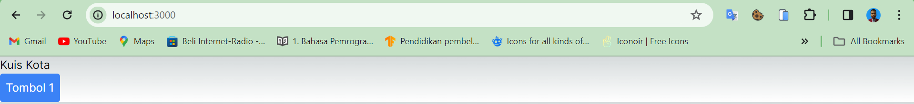

| Raden Rizki | 2141720064 | TI - 3C | 13 |

## Praktikum 1: Event Handler

### Langkah 1

### Langkah 2

## Praktikum 2

### Langkah 1

Tampilan pada browser menampilkan button kedua dengan berupa pembatas berdasarkan tag hr dan nama button sesuai dengan arguments yang diberikan pada value namaTombol di component Tombol_2 tersebut. Selain itu, pesan yang ditampilkan juga didasarkan pada argument isiPesan Tombol_2.

## Praktikum 3

### Langkah 1: Propagation

### Langkah 2: Stop Propagation

## Praktikum 4

### Langkah 1

### Langkah 2

## Praktikum 5

### Langkah 1

Form Code: [Go to form.tsx](/pbf-pertemuan-04/src/components/form.tsx)

Page Code: [Go to page.tsx](/pbf-pertemuan-04/src/app/page.tsx)

Dengan menggunakan kondisi dan state yang dapat diperbarui, setiap jawaban pada form dapat menampilkan pesan error yang berbeda-beda, jika jawaban salah maka pesan error akan ditampilkan karena ini memenuhi kondisi untuk menampilkan error dari tag p, sedangkan jika jawaban benar, maka form tidak akan ditampilkan dan menampilkan pesan "Yay... Jawaban Benar!" karena state status menjadi success dan pesan tersebut akan direturn.

### Langkah 2

## Praktikum 6

### Langkah 1

Accordion Code: [Go to accordion.tsx](/pbf-pertemuan-04/src/components/accordion.tsx)

Setiap panel ditampilkan secara bergantian, tergantung panel mana yang diklik "Tampilkan". Hal tersebut dapat terjadi dengan mengecek kondisi antara activeIndex saat ini dengan value dari setiap panel, jika panel memiliki activeIndex dan value yang sesuai maka teks akan ditampilkan. Saat button "Tampilkan" diklik maka activeIndex saat ini juga akan ikut berubah.

### Langkah 2
