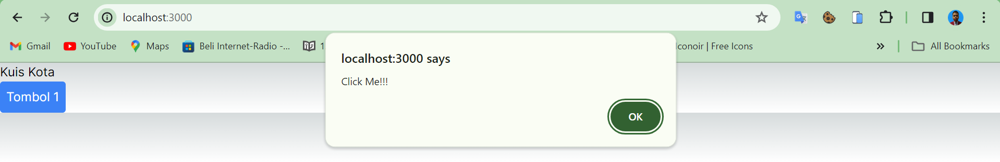

| Raden Rizki | 2141720064 | TI - 3C | 13 |

## Praktikum 1: Event Handler

### Langkah 1

### Langkah 2

## Praktikum 2

### Langkah 1

Tampilan pada browser menampilkan button kedua dengan berupa pembatas berdasarkan tag hr dan nama button sesuai dengan arguments yang diberikan pada value namaTombol di component Tombol_2 tersebut. Selain itu, pesan yang ditampilkan juga didasarkan pada argument isiPesan Tombol_2.

## Praktikum 3

### Langkah 1: Propagation

### Langkah 2: Stop Propagation

## Praktikum 4

### Langkah 1

### Langkah 2

