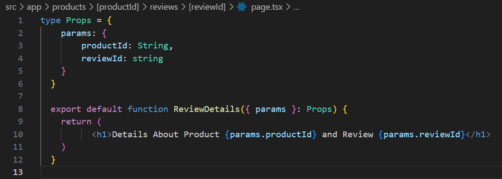
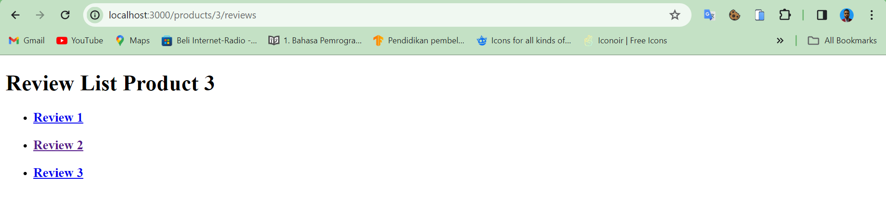

| Raden Rizki | 2141720064 | TI - 3C | 13 |

## Praktikum 1: Membuat routing sederhana

### Langkah 1: Menambah file page.tsx di folder app

### Langkah 2: Menambah file page.tsx di folder app/about

### Langkah 3: Menambah file page.tsx di folder app/profile

## Praktikum 2: Membuat routing bersarang (Nested Routing)

### Langkah 1: Menambah file page.tsx di folder app/blogs, app/blogs/first dan app/blogs/second

Dengan menggunakan konsep routing tersebut, maka setiap ada route atau path baru, maka perlu juga dilakukan penambahan folder baru maupun page.tsx lainnya, hal ini tentunya tidak fleksibel dan menambah resourse yang digunakan untuk route baru tersebut. Selain itu, jika route yang dibuat semakin banyak, maka semakin kompleks pula struktur folder yang tersimpan.

## Praktikum 3: Membuat routing dinamis (Dynamic Routing)

### Langkah 1: Menambah file page.tsx di folder app/products

### Langkah 2: Menambah file page.tsx di folder app/products/[productId]

### Langkah 3: Memperbaiki implementasi Praktikum 2 menggunakan Dynamic Routes

### Langkah 3: Membuat halaman dengan routing /products/[productId]/reviews/[reviewId]

## Praktikum 4: Navigasi dengan Link Component

### Langkah 1: Menambahkan penggunaan Link komponen untuk mengakses halaman /profile dan /about

### Langkah 2: Menambahkan penggunaan Link komponen untuk mengakses halaman lainnya

