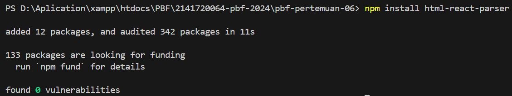
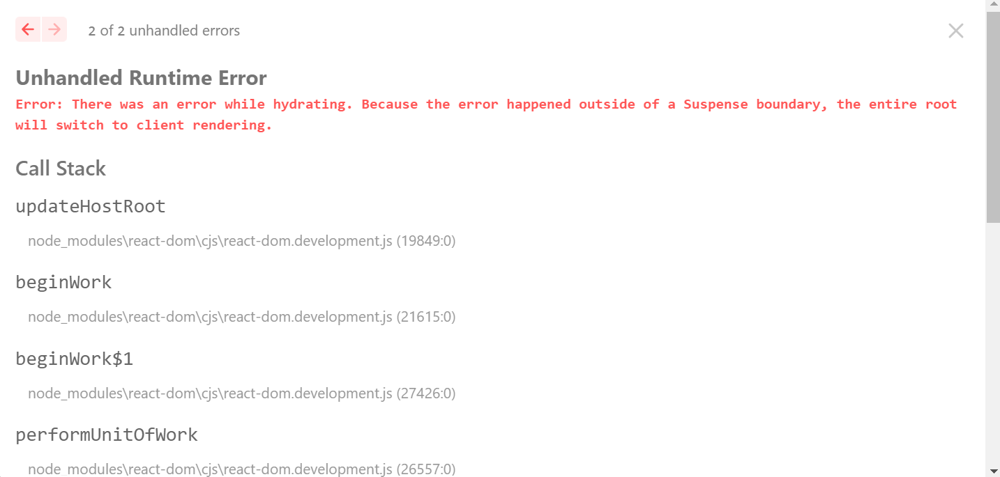
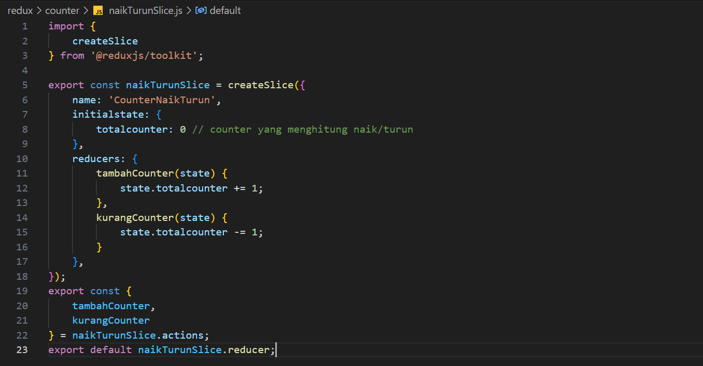

| Raden Rizki | 2141720064 | TI - 3C | 13 |

## Praktikum 1: Instalasi Redux dan bootstrap

### Langkah 1: Membuat Proyek Baru


### Langkah 2: Menginstall Bootstrap

```bash
npm install bootstrap
```


### Langkah 3: Memperbarui file _app.tsx di pages


### Langkah 4: Memperbarui file index.tsx di pages


Laman menampilkan content baru sesuai dengan perbaruan yang sudah ditambahkan kedalam file pages/index.tsx, sehingga saat ini hanya button dan text yang ditampilkan berupa pop up dilaman browser ketika button diklik.

## Praktikum 2: Contoh Login dengan Redux

### Langkah 1: Menginstall redux-toolkit dan redux-persistent

```bash
npm i --save redux-persist react-redux @reduxjs/toolkit 
```


### Langkah 2: Menginstall wrapper untuk redux di next.js

```bash
npm i --save next-redux-wrapper
```


### Langkah 3: Menggunakan html parser yang ada di react

```bash
npm install html-react-parser
```



### Langkah 4: Mengecek package.json


### Langkah 5: Membuat file redux/auth/authSlice.js


### Langkah 6: Membuat file redux/store/store.js


### Langkah 7: Membuat file .env.local


### Langkah 8: Membuat file pages/login.tsx


Terjadi saat mengakses /login, sehingga perlu memberbarui file _app.tsx


**Soal**

1. Coba akses http://localhost:3000/login, dan klik tombol login. Kemudian lakukan refresh page berkali-kali (jika perlu restart npm run dev nya). Simpulkan apa yang terjadi ?

Terjadi error ketika merefresh laman dalam keadaan sudah login sebagai berikut.





2. Baris 25 dan 30 terdapat method parse(), apa yang terjadi jika kita tidak menggunakan method tersebut?


Saat parse tidak digunakan, maka kode dalam parse sebelumnya akan dianggap sebagai string, bukan sintaks dari html, sehingga yang ditampilkan akan menjadi seperti gambar diatas.

## Praktikum 3: Membuat Aplikasi Counter Sederhana

### Langkah 1: Membuat file redux/counter/naikTurunSlice.js



### Langkah 2: Modifikasi redux/store/store.js


### Langkah 3: Membuat file baru pages/counter.tsx


