| Raden Rizki | 2141720064 | TI - 3C | 13 |

## Praktikum 1: Instalisasi Laravel

### Langkah 1: Membuat Proyek Laravel

```bash
composer create-project --prefer-dist laravel/laravel:^11.0 pbf-pertemuan-07-laravel-nextjs
```

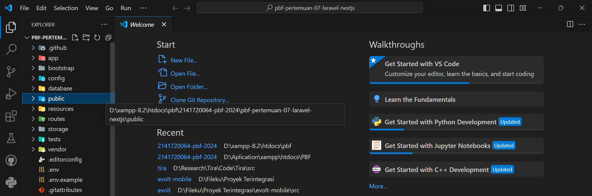


### Langkah 2: Menjalankan Proyek

```bash
php artisan serve
```

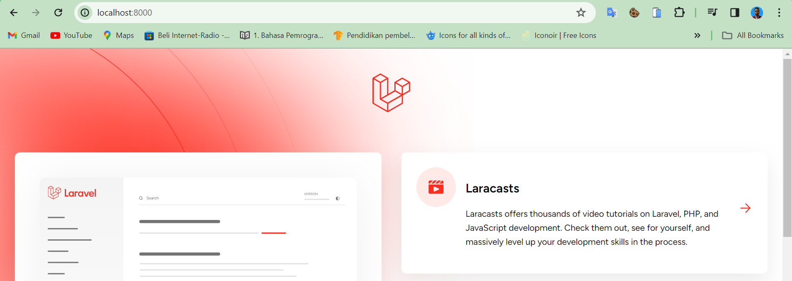

### Langkah 3: Konfigurasi Koneksi Database

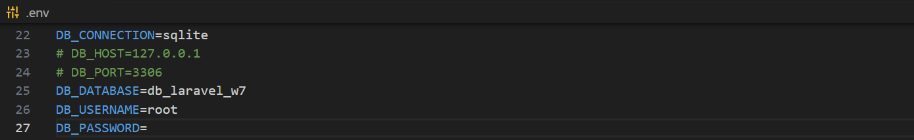

### Langkah 4: Membuat Database

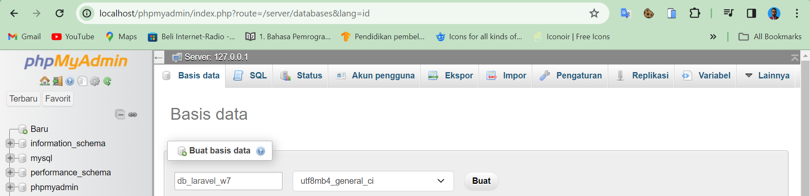

### Langkah 5: Membuat Model dan Migration

```bash
php artisan make:model Post -m
```

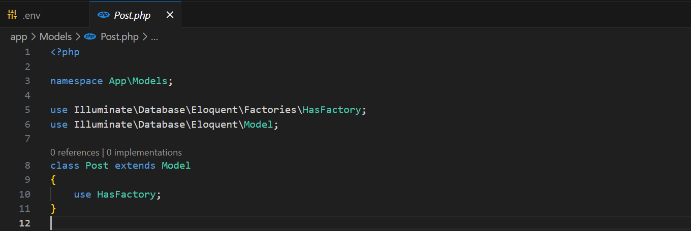

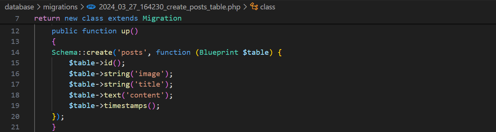

### Langkah 6: Menjalankan Migration

```bash
php artisan migrate
```

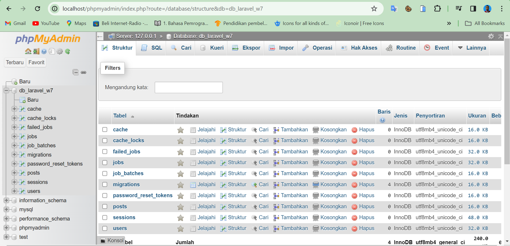

### Langkah 7: Menambahkan Mass Assignment

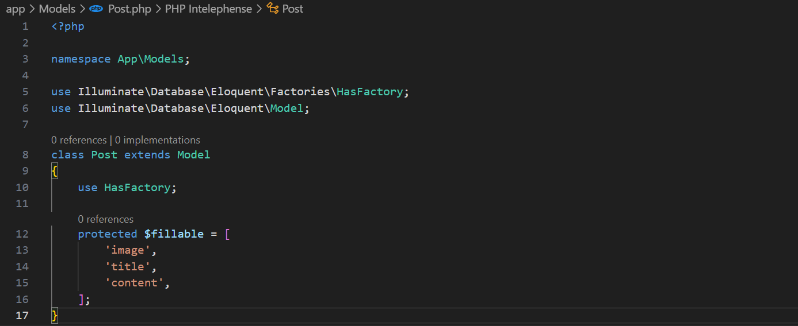

### Langkah 8: Menjalankan Storage Link

```bash
php artisan storage:link
```

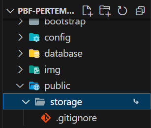

## Praktikum 2: Membuat API Resources

### Langkah 1: Membuat API Resources

```bash
php artisan make:resource PostResource
```

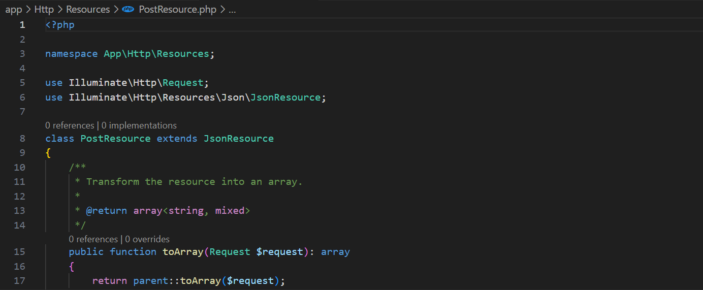

### Langkah 2: Melakukan Custom API Resources

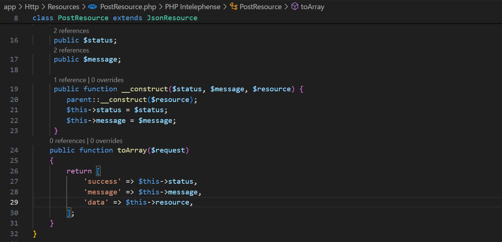

## Praktikum 3: Menampilkan Data dari Database

### Langkah 1: Membuat Controller

```bash
php artisan make:controller Api/PostController
```

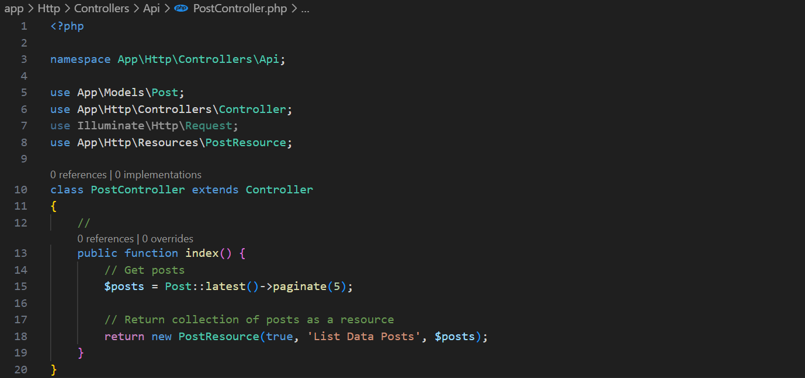

### Langkah 2: Membuat Route API Resource

```bash
php artisan install:api
```

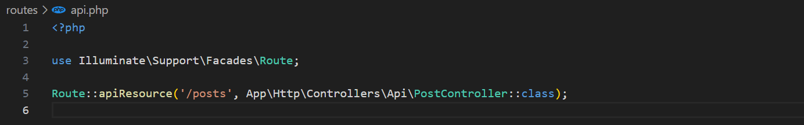

```bash
php artisan route:list
```

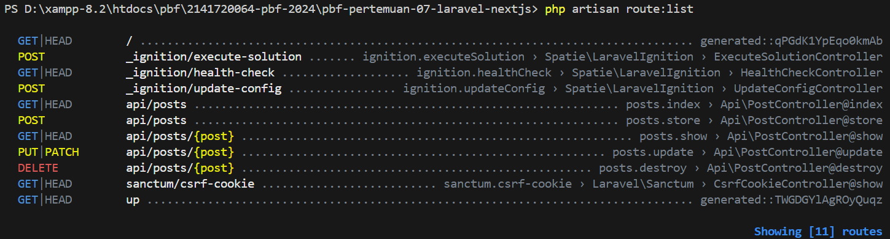

### Langkah 3: Uji Coba Rest API

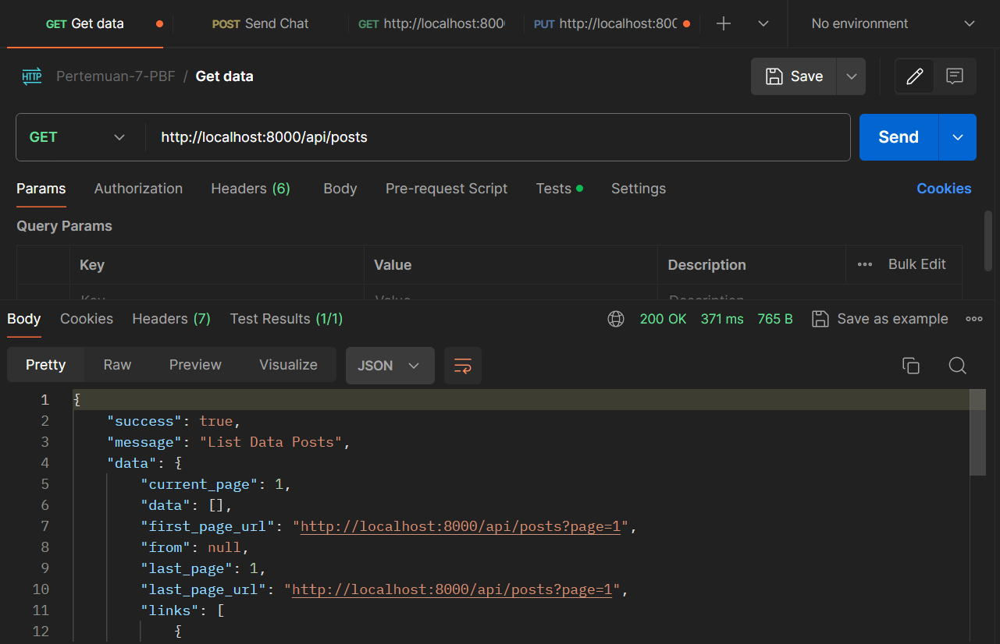

## Praktikum 4: Insert Data ke Database

### Langkah 1: Menambahkan Method Store


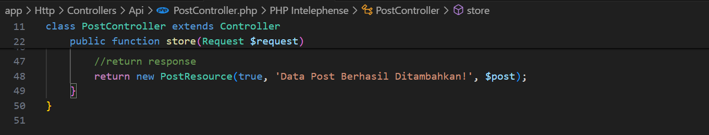

### Langkah 2: Uji Coba Rest API

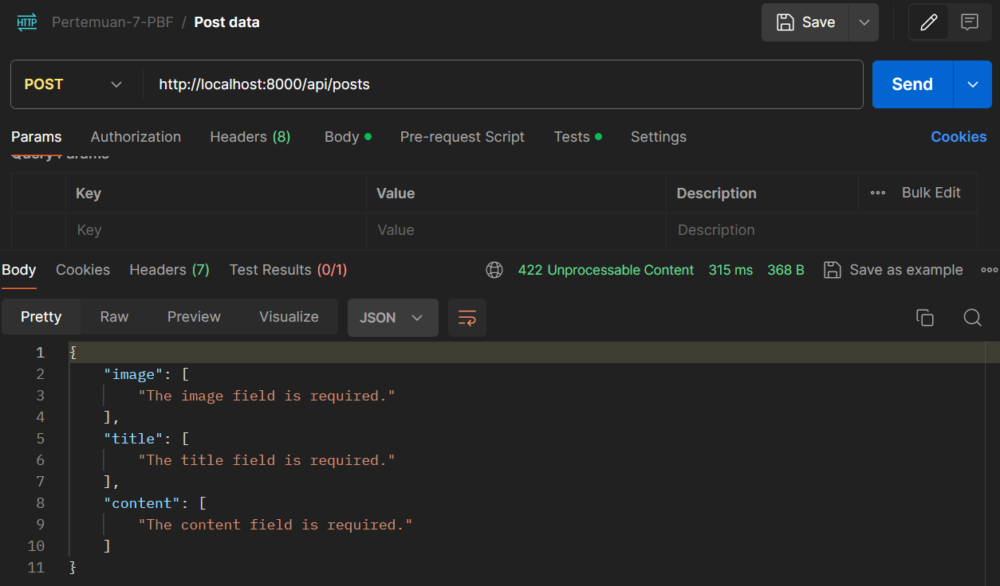

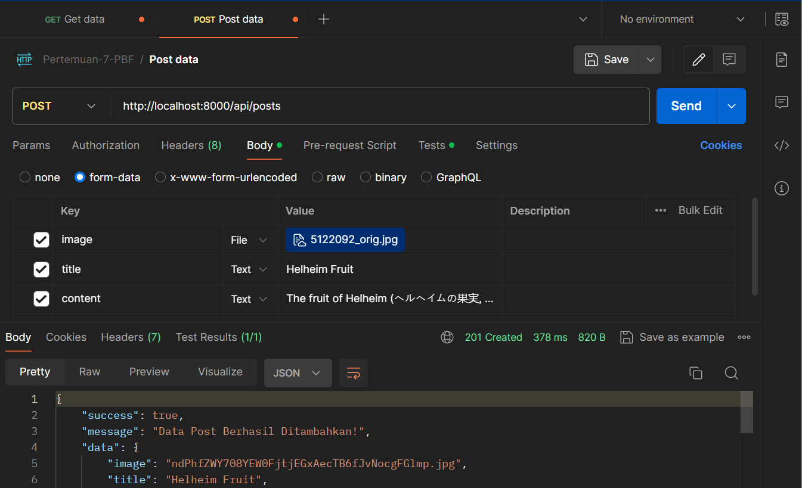

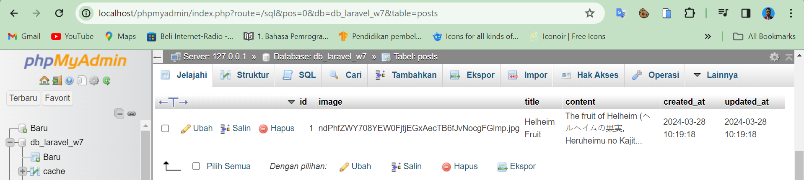

