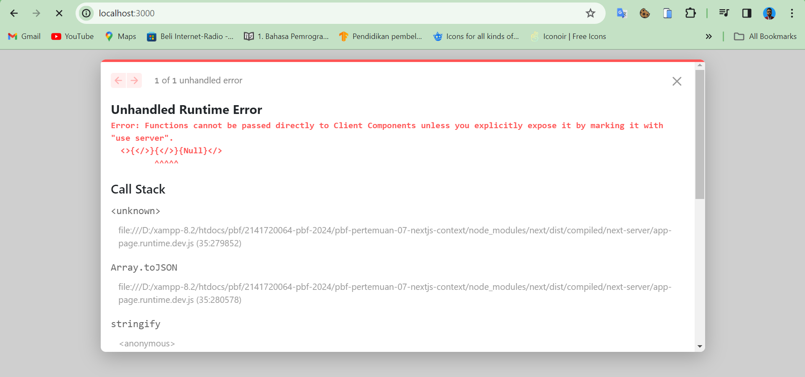
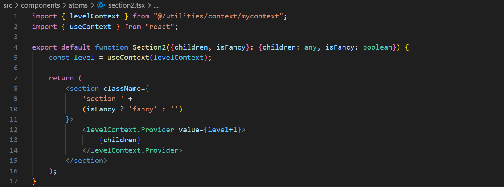

| Raden Rizki | 2141720064 | TI - 3C | 13 |

## Praktikum 1: Membuat Variasi Ukuran Teks Heading dengan Context

### Langkah 1: Buat project baru dan repo baru di GitHub

```bash
npx create-next-app pbf-pertemuan-07-nextjs-context
```


### Langkah 2: Buat struktur folder dengan prinsip [atomic design](https://bradfrost.com/blog/post/atomic-web-design/)


### Langkah 3: Buat komponen atom baru


### Langkah 4: Ubah isi kode page.tsx dan run





**Soal 1**

Capture hasilnya dan buatlah laporan di README.md. Jelaskan apa yang telah Anda pelajari dan bagaimana tampilannya saat ini?


Dengan menggunakan atomic design ini, struktur penulisan kode untuk sintaks lebih mudah digunakan dan untuk component yang memiliki struktur yang mirip ataupun class yang sama dapat menggunakan function component yang sudah dibuat tanpa harus menulis kode yang sama berulang kali, hanya perlu memasukkan parameter untuk kedinamisan tampilkan yang dihasilkan dari kode yang dibuat. Tampilan laman yang ditampilkan dapat seperti hasil dari kode html yang umum digunakan, dengan variasi penggunaan heading.

### Langkah 5.1: Buat Context


### Langkah 5.2: Gunakan Context


### Langkah 5.3: Sediakan context


**Soal 2**

Capture hasilnya dan buatlah laporan di README.md. Jelaskan apa yang telah Anda pelajari dan bagaimana tampilannya saat ini?

Meneruskan suatu value dapat dilakukan dengan menggunakan context, sehingga child hanya perlu mengakses value dari node atas terdekat atau parent, tanpa perlu diberi value untuk masing-masing child. Meskipun menggunakan context, tampilan laman yang dihasilkan masih sama seperti sebelumnya.

### Langkah 6: Menggunakan dan menyediakan context dari komponen yang sama


**Soal 3**

Capture hasilnya dan buatlah laporan di README.md. Jelaskan apa yang telah Anda pelajari dan bagaimana tampilannya saat ini?

Selain dapat membagikan value ke child secara manual, context dapat mengirimkan data dengan operasi atau pola yang sama, seperti pada langkah keenam ini, dapat dilakukan pengiriman value secara auto increment, namun perbedaan tampilan saat ini adalah, ukuran font lebih kecil, dikarenakan dengan value default 1, maka saat sampai ke child nya sudah dilakukan penambahan.

## Praktikum 2: Membuat Context melewati komponen perantara

### Langkah 1: Buat komponen atom baru




### Langkah 2: Tambahkan ProfilePage ke page.tsx lalu run


**Soal 4**

Capture hasilnya dan buatlah laporan di README.md. Tambahkan teks Nama dan NIM pada bagian komponen Post agar menunjukkan itu hasil kerja Anda!


## Praktikum 3: Membuat Context Tema Light/Dark

### Langkah 1: Membuat variabel tema


### Langkah 2: Buat komponen atom NavBar


## Langkah 3: Buat Provider


## Langkah 4: Buat masing-masing page


## Langkah 5: Buat routing


**Soal 5**

Silakan save semua dan lakukan running di browser Anda. Capture hasilnya dan buatlah laporan di README.md. Tambahkan teks Nama dan NIM pada setiap page routing agar menunjukkan itu hasil kerja Anda sendiri!

1. Apakah toggle button tema sudah berfungsi ? jika belum, silakan perbaiki!


2. Mengapa ketika refresh atau berpindah halaman tema tidak permanen ? Buatlah menjadi permanen walaupun page sudah direfresh dan pindah halaman!

Hal tersebut dapat terjadi karena tidak disimpannya state tema dalam browser, masalah ini dapat diatasi dengan kode sebagai berikut.

