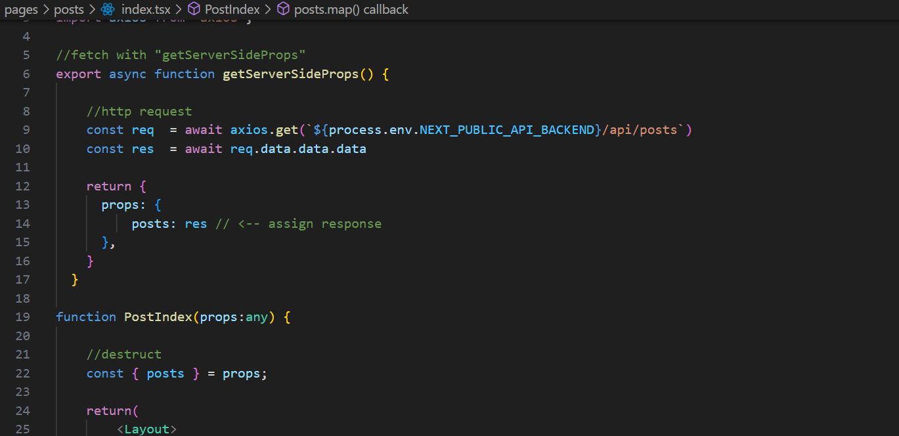

| Raden Rizki | 2141720064 | TI - 3C | 13 |

## Praktikum 1: Membuat Project Baru di Next.js

### Langkah 1: Membuat Proyek Baru Next.js

```bash
npx create-next-app pbf-pertemuan-07-nextjs-crud
```


```bash
npm run dev
```


## Praktikum 2: Install Bootsrap dan Membuat Layout di Next.js

### Langkah 1: Install Bootstrap

```bash
npm install bootstrap
```


### Langkah 2: Konfigurasi Boostrap di Next.js


### Langkah 3: Membuat Komponen Navbar


### Langkah 4: Membuat Layout


## Praktikum 3: Menampilkan Data di Next.js (Server Side)

### Langkah 1: Install Axios

```bash
npm install axios
```

### Langkah 2: Konfigurasi Env untuk Endpoint


### Langkah 3: Menampilkan Data di NextJS



### Langkah 4: Uji Coba Menampilkan Data

Menambahkan Legaci Behaviour untuk menggunakan tag a (<a>)


